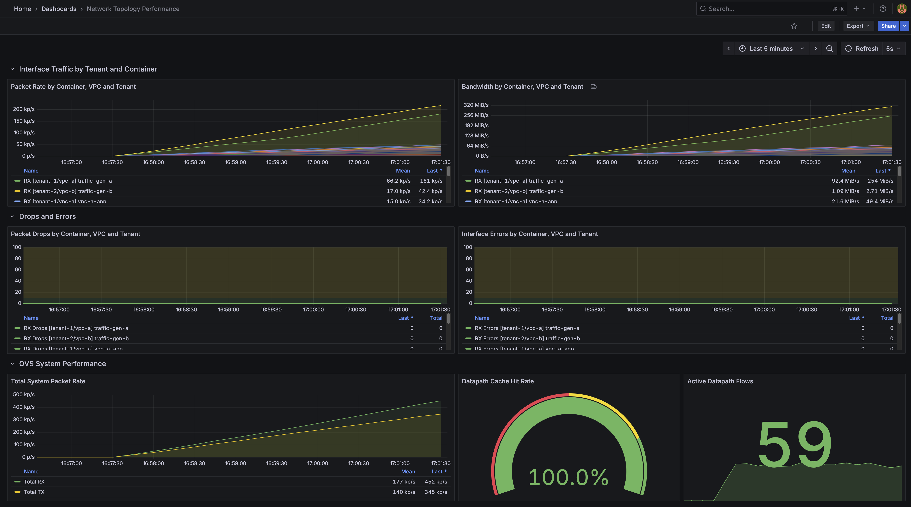
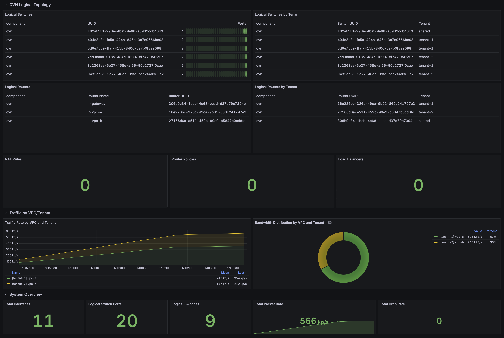

# OVS Container Lab

**A Software-Defined Networking (SDN) lab** using Open vSwitch (OVS) data plane and Open Virtual Network (OVN) control plane, running in a Lima VM. Features a custom **OVN Container Network Plugin** (`ovs-container-network`) for seamless Docker integration with automatic OVN central management (`ovn.auto_create: "true"`). Demonstrates enterprise multi-VPC cloud architectures with full external connectivity - **complete SDN implementation** with NAT Gateway for internet access.

## Quick Start

```bash
# Install Lima (lightweight VM for macOS)
brew install lima

# Start everything (VM + containers + OVN plugin + networking)
make up
# First time: Lima will prompt you to confirm VM creation
# Select "Proceed with the current configuration" and press Enter
# Initial setup takes ~5 minutes to download Ubuntu and install everything

# Verify everything is working
make check
# Runs comprehensive diagnostics: OVS, OVN, containers, plugin, NAT gateway

# Generate traffic (using Microsoft ntttcp)
make traffic-standard  # Standard traffic (100 Mbps, 4 threads)
make traffic-chaos     # Heavy chaos traffic (1 Gbps, 16 threads)
make traffic-stop      # Stop all traffic generation

# Access monitoring from your Mac
make dashboard         # Open Grafana (http://localhost:3000)
# Default credentials: admin/admin

# Clean up everything
make clean
```

### First Time Setup

When you run `make up` for the first time, Lima will show:
```
? Creating an instance "ovs-lab"
> Proceed with the current configuration
  Open an editor to review or modify the current configuration
  Choose another template (docker, podman, archlinux, fedora, ...)
  Exit
```

**Just press Enter** to accept the default configuration. The initial setup will:
1. Download Ubuntu 24.04 (~500MB)
2. Create the VM
3. Install Docker, OVS, and OVN
4. Configure networking
5. Start all containers

This takes about 5 minutes on first run. Subsequent starts take only seconds.

**What happens during setup:**
1. OVN central image build
2. OVS Container Network Plugin (`ovs-container-network`) installation
3. Monitoring exporters setup (OVS and OVN)
4. Container stack startup with automatic network creation via plugin
5. OVS chassis connection to OVN control plane
6. Auto-creation of OVN central when needed (ovn.auto_create: "true")

## Architecture

```
┌──────────────────────────────────────────────────────────────────────────┐
│                              macOS Host                                  │
│  • Make commands (orchestration)                                         │
│  • Port forwards: 3000 (Grafana), 9090 (Prometheus), 9475 (OVS metrics)  │
└────────────────────┬─────────────────────────────────────────────────────┘
                     │ Lima VM (Virtualization.framework)
┌────────────────────▼─────────────────────────────────────────────────────┐
│                         Lima VM - Ubuntu 24.04                           │
│ ┌───────────────────────────────────────────────────────────────────────┐│
│ │                    OVN Central (SDN Control Plane)                    ││
│ │  ┌─────────────────┐                    ┌─────────────────┐           ││
│ │  │ Northbound DB   │                    │ Southbound DB   │           ││
│ │  │ (Logical View)  │───────────────────►│ (Physical View) │           ││
│ │  └─────────────────┘                    └─────────────────┘           ││
│ └───────────────────────────────────────────────────────────────────────┘│
│                                    │                                     │
│              OVN Logical Topology  ▼  (Northbound View)                  │
│ ┌───────────────────────────────────────────────────────────────────────┐│
│ │                         Logical Routers & Switches                    ││
│ │                                                                       ││
│ │  ┌──────────────┐     ┌──────────────┐     ┌──────────────┐           ││
│ │  │ lr-gateway   │     │  lr-vpc-a    │     │  lr-vpc-b    │           ││
│ │  │ (Transit GW) │◄────┤  (Tenant-1)  ├────►│  (Tenant-2)  │           ││
│ │  └──────┬───────┘     └──────┬───────┘     └──────┬───────┘           ││
│ │         │                    │                    │                   ││
│ │    ┌────▼─────┐          ┌───▼────────────────────▼─────┐             ││
│ │    │ls-transit│          │         Logical Switches     │             ││
│ │    │192.168.  │          ├────────────┬─────────────────┤             ││
│ │    │100.0/24  │          │  VPC-A     │     VPC-B       │             ││
│ │    └──────────┘          ├────────────┼─────────────────┤             ││
│ │                          │ls-vpc-a-web│ ls-vpc-b-web    │             ││
│ │                          │10.0.1.0/24 │ 10.1.1.0/24     │             ││
│ │                          ├────────────┼─────────────────┤             ││
│ │                          │ls-vpc-a-app│ ls-vpc-b-app    │             ││
│ │                          │10.0.2.0/24 │ 10.1.2.0/24     │             ││
│ │                          ├────────────┼─────────────────┤             ││
│ │                          │ls-vpc-a-db │ ls-vpc-b-db     │             ││
│ │                          │10.0.3.0/24 │ 10.1.3.0/24     │             ││
│ │                          ├────────────┼─────────────────┤             ││
│ │                          │ls-vpc-a-   │ ls-vpc-b-test   │             ││
│ │                          │test        │ 10.1.4.0/24     │             ││
│ │                          │10.0.4.0/24 │                 │             ││
│ │                          └────────────┴─────────────────┘             ││
│ └───────────────────────────────────────────────────────────────────────┘│
│                                    │                                     │
│              OVS Data Plane        ▼  (Southbound View)                  │
│ ┌───────────────────────────────────────────────────────────────────────┐│
│ │                    OVS Bridge (br-int) - OpenFlow Rules               ││
│ │  • Processes packets based on OVN-programmed flows                    ││
│ │  • GENEVE tunneling for overlay networking                            ││
│ │  • Connected via OVN Container Network Plugin                         ││
│ │  • Auto-creates OVN central when needed (ovn.auto_create: true)       ││
│ └─────────────────────────┬─────────────────────────────────────────────┘│
│                           │                                              │
│         Docker Containers ▼  (Workloads with OVN Port Bindings)          │
│ ┌───────────────────────────────────────────────────────────────────────┐│
│ │  VPC-A (Tenant-1)                    VPC-B (Tenant-2)                 ││
│ │  ┌──────────────┐                    ┌──────────────┐                 ││
│ │  │ vpc-a-web    │                    │ vpc-b-web    │                 ││
│ │  │ 10.0.1.10    │                    │ 10.1.1.10    │                 ││
│ │  │ MAC:02:00:   │                    │ MAC:02:00:   │                 ││
│ │  │ 00:01:01:0a  │                    │ 00:02:01:0a  │                 ││
│ │  └──────────────┘                    └──────────────┘                 ││
│ │  ┌──────────────┐                    ┌──────────────┐                 ││
│ │  │ vpc-a-app    │                    │ vpc-b-app    │                 ││
│ │  │ 10.0.2.10    │                    │ 10.1.2.10    │                 ││
│ │  └──────────────┘                    └──────────────┘                 ││
│ │  ┌──────────────┐                    ┌──────────────┐                 ││
│ │  │ vpc-a-db     │                    │ vpc-b-db     │                 ││
│ │  │ 10.0.3.10    │                    │ 10.1.3.10    │                 ││
│ │  └──────────────┘                    └──────────────┘                 ││
│ │  ┌──────────────┐                    ┌──────────────┐                 ││
│ │  │traffic-gen-a │                    │traffic-gen-b │                 ││
│ │  │ 10.0.4.10    │                    │ 10.1.4.10    │                 ││
│ │  └──────────────┘                    └──────────────┘                 ││
│ │                                                                       ││
│ │  Special Containers:                                                  ││
│ │  ┌──────────────┐  ┌──────────────┐  ┌──────────────┐                 ││
│ │  │ nat-gateway  │  │ prometheus   │  │   grafana    │                 ││
│ │  │192.168.100.  │  │  (metrics)   │  │ (dashboards) │                 ││
│ │  │    254       │  └──────────────┘  └──────────────┘                 ││
│ │  │ MASQUERADE   │                                                     ││
│ │  └──────┬───────┘                                                     ││
│ └─────────┼─────────────────────────────────────────────────────────────┘│
│           │                                                              │
│           ▼ External Network (Internet via NAT)                          │
└──────────────────────────────────────────────────────────────────────────┘

Traffic Flow Examples:
• Intra-VPC: vpc-a-web → ls-vpc-a-web → lr-vpc-a → ls-vpc-a-app → vpc-a-app
• Inter-VPC: vpc-a-web → lr-vpc-a → lr-gateway → lr-vpc-b → vpc-b-web
• External:  vpc-a-web → lr-vpc-a → lr-gateway → nat-gateway → Internet
```

## Core Commands (Run from macOS)

| Command | Description |
|---------|------------|
| `make up` | Complete setup: VM, containers, OVN topology, monitoring |
| `make down` | Stop containers (VM stays running) |
| `make status` | Show VM, container, and OVS/OVN status |
| `make check` | Run comprehensive network diagnostics |
| `make test` | Run connectivity tests between containers |
| `make clean` | Delete VM and everything |

## Traffic Generation & Chaos Engineering

**Traffic Generation (using Microsoft ntttcp instead of iperf3):**

| Command | Description |
|---------|------------|
| `make traffic-standard` | Generate standard traffic (100 Mbps, 4 threads) |
| `make traffic-chaos` | Heavy chaos traffic (1 Gbps, 16 threads) |
| `make traffic-stop` | Stop all traffic generation |
| `make traffic-status` | Check traffic generation status |

**Chaos Engineering (using Pumba for network fault injection):**

| Command | Description |
|---------|------------|
| `make chaos-inject` | Run Pumba network chaos (5 min) |
| `make chaos-loss` | Simulate 30% packet loss (1 min) |
| `make chaos-delay` | Add 100ms network delay (1 min) |
| `make chaos-bandwidth` | Limit bandwidth to 1mbit (1 min) |
| `make chaos-partition` | Create network partition (30s) |
| `make chaos-corruption` | Introduce packet corruption (1 min) |
| `make chaos-duplication` | Introduce packet duplication (1 min) |

## Configuration

The lab uses YAML-based network configuration to define the entire topology, container placement, and network settings. The configuration system is flexible and supports everything from simple single-host setups to complex multi-tenant deployments.

### Using Configuration Files

```bash
# Start the environment
make up

# Run diagnostics and tests
make check
make test
```

### Docker Compose Profiles

The lab uses Docker Compose profiles to manage different deployment scenarios:
- Default profile: Core OVS/OVN infrastructure
- `--profile testing`: Add test containers
- `--profile traffic`: Add traffic generators
- `--profile chaos`: Add chaos engineering tools
- `--profile vpc`: Multi-VPC setup with OVN/FRR

### Configuration Structure

The configuration file defines your entire network topology:

```yaml
# Global settings
global:
  encapsulation: geneve    # Tunnel type (geneve/vxlan)
  mtu: 1400                # Network MTU

# Host definitions (future multi-host support)
hosts:
  lima-host:
    chassis_name: chassis-host
    management_ip: 192.168.100.1
    tunnel_ip: 192.168.100.1
    roles:
      - ovn-central
      - ovn-controller
      - gateway

# VPC definitions with tenant isolation
vpcs:
  vpc-a:
    tenant: tenant-1           # Tenant identifier
    cidr: 10.0.0.0/16          # VPC CIDR block
    router:
      name: lr-vpc-a           # Logical router name
      mac: "00:00:00:01:00:00" # Router MAC
    switches:                   # Logical switches (subnets)
      - name: ls-vpc-a-web
        cidr: 10.0.1.0/24
        tier: web
      - name: ls-vpc-a-app
        cidr: 10.0.2.0/24
        tier: app
      - name: ls-vpc-a-db
        cidr: 10.0.3.0/24
        tier: db

# Transit network for inter-VPC and external connectivity
transit:
  cidr: 192.168.100.0/24
  gateway_router:
    name: lr-gateway
    mac: "00:00:00:00:00:01"

# Container definitions with network assignments
containers:
  vpc-a-web:
    host: lima-host            # Which host to run on
    vpc: vpc-a                 # VPC assignment
    switch: ls-vpc-a-web       # Logical switch connection
    ip: 10.0.1.10              # Static IP address
    mac: "02:00:00:01:01:0a"   # Persistent MAC address
    tier: web                  # Tier classification
```

### Key Configuration Features

#### Multi-Tenant Support
Each VPC is assigned to a tenant, enabling complete isolation and separate monitoring:
```yaml
vpcs:
  vpc-a:
    tenant: tenant-1  # Isolated from tenant-2
  vpc-b:
    tenant: tenant-2  # Separate routing domain
```

#### Persistent MAC Addresses
Containers maintain their MAC addresses across restarts:
```yaml
containers:
  vpc-a-web:
    mac: "02:00:00:01:01:0a"  # Survives container restarts
```

#### Flexible Subnet Design
Create any number of subnets per VPC:
```yaml
switches:
  - name: ls-vpc-a-dmz
    cidr: 10.0.100.0/24
    tier: dmz
  - name: ls-vpc-a-mgmt
    cidr: 10.0.200.0/24
    tier: management
```

### Creating Custom Configurations

Network topology is defined directly in docker-compose files:

1. **Edit docker-compose.yml:**
   - Define VPC networks with the OVS plugin
   - Configure OVN logical switches and routers
   - Set up container networking

2. **Start your configuration:**
   ```bash
   docker compose up -d
   # Or with profiles:
   docker compose --profile vpc up -d
   ```

### Configuration Examples

#### Simple Two-Tier Application
```yaml
vpcs:
  app-vpc:
    tenant: my-app
    cidr: 172.16.0.0/16
    switches:
      - name: ls-frontend
        cidr: 172.16.1.0/24
      - name: ls-backend
        cidr: 172.16.2.0/24

containers:
  frontend-1:
    vpc: app-vpc
    switch: ls-frontend
    ip: 172.16.1.10
  backend-1:
    vpc: app-vpc
    switch: ls-backend
    ip: 172.16.2.10
```

#### Multi-Environment Setup
```yaml
vpcs:
  dev:
    tenant: development
    cidr: 10.10.0.0/16
  staging:
    tenant: staging
    cidr: 10.20.0.0/16
  prod:
    tenant: production
    cidr: 10.30.0.0/16
```

### Configuration Management

The orchestrator.py script provides management commands:

```bash
# Plugin installation and management
python3 orchestrator.py install-plugin
python3 orchestrator.py uninstall-plugin

# Monitoring setup
python3 orchestrator.py setup-monitoring

# Run integration tests
python3 orchestrator.py test
```

## Network Diagnostics

The `make check` command runs comprehensive diagnostics:

**OVS Bridge Status**:
- Bridge existence and port count
- Interface ID verification

**OVN Logical Configuration**:
- Logical routers and switches
- NAT gateway configuration

**OVN Port Bindings**:
- All ports bound to chassis
- Proper MAC address assignment

**Container Connectivity**:
- Gateway reachability
- ARP resolution

**NAT Gateway Status**:
- Container running
- MASQUERADE rules
- External connectivity

## Orchestrator Commands

The orchestrator (`orchestrator.py`) provides fine-grained control:

```bash
# Run from inside the VM (make shell-vm)
cd ~/code/ovs-container-lab

# Plugin management
sudo python3 orchestrator.py install-plugin     # Install ovs-container-network plugin
sudo python3 orchestrator.py uninstall-plugin   # Uninstall plugin

# Infrastructure setup
sudo python3 orchestrator.py setup-monitoring   # Setup OVS/OVN exporters
sudo python3 orchestrator.py setup-chassis      # Configure OVS chassis

# Diagnostics
sudo python3 orchestrator.py check              # Full diagnostics
sudo python3 orchestrator.py test               # Connectivity tests

# Chaos engineering
sudo python3 orchestrator.py chaos packet-loss --duration 60
sudo python3 orchestrator.py chaos latency --duration 60
```

## Monitoring (Accessible from macOS)

The lab includes dual monitoring stacks for flexibility:
- **Prometheus + Grafana**: Time-tested metrics and visualization
- **InfluxDB + Telegraf**: Alternative time-series database with efficient storage

| Service | URL | Credentials | Description |
|---------|-----|-------------|-------------|
| Grafana | http://localhost:3000 | admin/admin | Dashboards and visualization |
| Prometheus | http://localhost:9090 | - | Metrics storage (pull-based) |
| InfluxDB | http://localhost:8086 | admin/admin | Time-series database |
| OVS Metrics | http://localhost:9475 | - | Raw OVS exporter metrics |

**Telegraf** automatically collects metrics from:
- OVS Exporter (port 9475) - OVS bridge and interface statistics
- OVN Exporter (port 9476) - OVN logical topology metrics
- Docker containers - Resource usage and network stats
- System metrics - CPU, memory, disk, network

**Note**: Monitoring includes comprehensive OVS and OVN exporters with Prometheus/Grafana integration for real-time network visibility.

### Network Topology Performance Dashboard

The comprehensive Grafana dashboard provides real-time visibility into all network topology components with multi-tenant grouping:


*Dashboard showing interface traffic, drops, errors, and OVS/OVN topology metrics grouped by tenant, VPC, and container*


*Detailed view of logical routers, switches, NAT rules, and system performance metrics*

**Key Metrics Monitored:**
- **Interface Traffic**: Packet rates and bandwidth by container, VPC, and tenant
- **Network Health**: Packet drops and interface errors with multi-level grouping
- **OVS Performance**: Bridge packet rates, datapath cache hit rates, active flows
- **OVN Topology**: Logical switches and routers with tenant/VPC associations
- **Router Metrics**: NAT rules, routing policies, load balancers per router
- **System Overview**: Total interfaces, switch ports, and aggregate traffic rates

## Development & Debugging

```bash
# Shell access
make shell-vm     # SSH into Lima VM
make shell-ovn    # Shell into OVN container
make shell-ovs    # Shell into OVS container

# Monitoring
make logs         # Follow container logs
make dashboard    # Open Grafana (http://localhost:3000)
make metrics      # Show current OVS metrics

# Inside the VM
cd ~/code/ovs-container-lab
sudo ovs-vsctl show              # OVS configuration
sudo docker exec ovn-central ovn-nbctl show  # OVN logical topology
sudo docker exec ovn-central ovn-sbctl show  # OVN physical bindings
```

## How It Works (SDN Architecture)

1. **OVN Control Plane**: Defines logical network topology (routers, switches, ports)
2. **OVS Data Plane**: Executes OpenFlow rules programmed by OVN controller
3. **OVN Container Network Plugin**: Custom Docker plugin (`ovs-container-network`) with auto-created OVN central (ovn.auto_create: "true")
4. **NAT Gateway**: Provides external internet connectivity for all VPCs
5. **GENEVE Tunnels**: Automatic overlay networking between VPCs
6. **Container Integration**: Ubuntu 22.04 containers bound to OVN logical switch ports via plugin
7. **Orchestrator**: Python-based automation (`orchestrator.py`) with proper error handling and verification
8. **Monitoring**: Dual stack with OVS/OVN exporters feeding Prometheus/Grafana and InfluxDB/Telegraf

### Network Flow Types

- **Intra-VPC**: Direct routing within a VPC (e.g., web → app → db)
- **Inter-VPC**: Routed through OVN logical routers (VPC-A ↔ VPC-B)
- **External**: VPC → OVN Router → NAT Gateway → Internet

## Prerequisites

- macOS 11+ (Big Sur or later)
- Lima (`brew install lima`)
- 4GB RAM available for VM
- 10GB disk space

## Project Structure

```
ovs-container-lab/
├── lima.yaml                    # Lima VM configuration
├── Makefile                     # Simplified control commands
├── docker-compose.yml           # Container stack with profiles
├── orchestrator.py              # Main orchestrator for setup and testing (renamed from orchestrator-simple.py)
├── scripts/
│   ├── ovs-docker-*.sh         # OVS-Docker integration
│   └── network-simulation/      # Traffic and chaos tools
├── ovn-container/               # OVN control plane
├── ovs-container-network/       # OVN-based Docker network plugin
├── nat-gateway/                 # External connectivity
├── traffic-generator/           # Traffic generation tools
├── grafana/                     # Monitoring dashboards
└── prometheus.yml               # Metrics configuration
```

## OVN Container Network Plugin

This lab includes a production-ready **OVN Container Network Plugin** (`ovs-container-network`) that provides native Docker integration with Open Virtual Network (OVN). The plugin is located in the `ovs-container-network/` directory.

**Key Features:**
- **Auto-creation of OVN central**: Automatically creates OVN central when needed with `ovn.auto_create: "true"`
- **Multi-VPC and multi-tenant support**: Complete network isolation between tenants
- **Transit networks for inter-VPC routing**: Seamless connectivity between VPCs
- **Docker Compose compatibility**: Native Docker integration
- **Persistent state management**: Survives container restarts
- **Ubuntu 22.04 base containers**: Modern, stable container environment

**Quick Usage:**
```bash
# The plugin requires OVN configuration for all networks
docker network create --driver ovs-container-network:latest \
  --subnet 10.0.0.0/24 \
  --opt ovn.switch=ls-my-network \
  --opt ovn.nb_connection=tcp:172.30.0.5:6641 \
  --opt ovn.sb_connection=tcp:172.30.0.5:6642 \
  --opt ovn.auto_create=true \
  my-network
```

See `ovs-container-network/README.md` for complete documentation.

## Troubleshooting

### VM won't start
```bash
# Check Lima VMs
limactl list

# Delete and recreate
make clean
make up
```

### "socket_vmnet" error
If you see an error about `socket_vmnet` not being installed, the VM was created but networking failed. Fix:
```bash
limactl stop ovs-lab
limactl delete ovs-lab
make up  # Will use simplified networking
```

### Containers can't connect
```bash
# Check OVS bridge in VM
make lima-ssh
sudo ovs-vsctl show

# Re-attach containers
make attach
```

### Port forwarding not working
```bash
# Check Lima status
limactl list

# Ensure services are running
make status
```

## Advanced Usage

### Custom OVS Configuration
```bash
make lima-ssh
sudo ovs-vsctl add-br br-custom
sudo ovs-vsctl set-controller br-custom tcp:127.0.0.1:6653
```

### Performance Testing
```bash
# Using ntttcp (Microsoft's network testing tool) instead of iperf3
# Inside VM - test internal connectivity
docker exec vpc-a-web ntttcp -r -t 30 &
docker exec vpc-b-web ntttcp -s 10.0.1.10 -t 30 -n 4

# Test external connectivity
docker exec vpc-a-web ping -c 5 8.8.8.8
docker exec vpc-b-web curl https://www.google.com
```

### Packet Capture
```bash
make lima-ssh
sudo tcpdump -i ovs-br0 -w capture.pcap
```

## License

MIT License - See LICENSE file for details