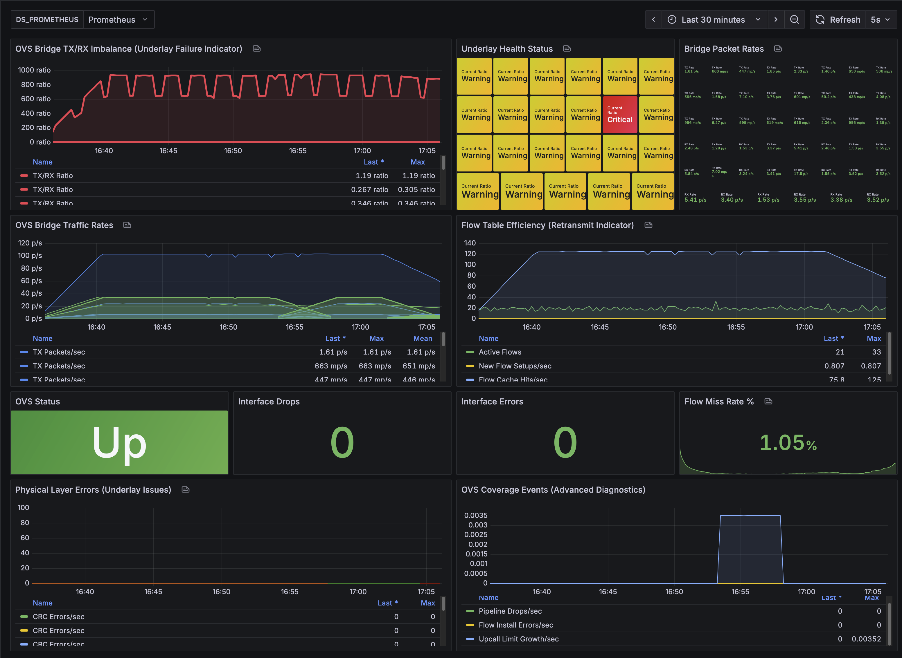
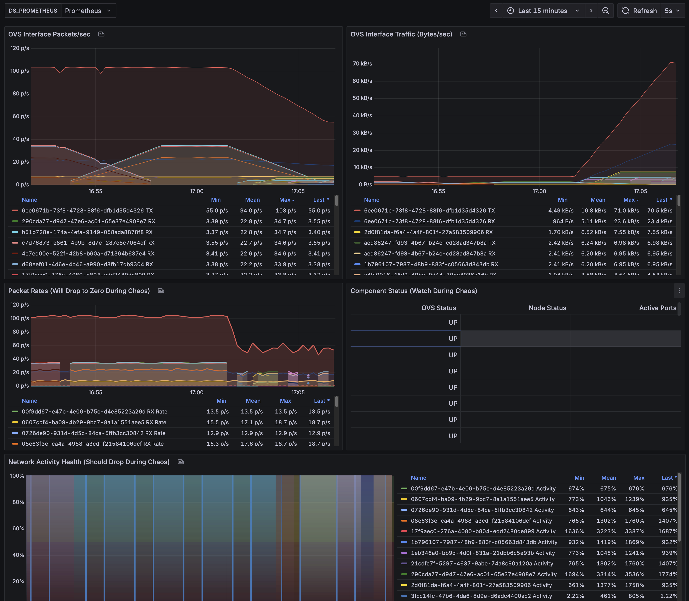

# Containerized Open vSwitch Monitoring & Network Chaos Testing Stack

A fully containerized testing and monitoring environment for Open vSwitch (OVS) networking with Docker containers, featuring comprehensive monitoring, automated traffic generation, and network chaos engineering capabilities. This stack provides complete OVS bridge setup, container networking, high-volume traffic simulation, and chaos testing - all running in Docker containers without requiring any host installations.

## What This Provides

- **Open vSwitch** running in userspace datapath mode for container network virtualization
- **Compose-managed test containers** automatically connected to OVS bridge with network services
- **High-volume traffic generation** using nping containers for realistic network load testing
- **Network chaos engineering** with Pumba integration for failure simulation
- **Comprehensive monitoring** through Prometheus and Grafana with OVS-specific dashboards
- **Automated network simulation** scripts for underlay failure detection testing
- **Custom exporters** for OVS and Docker metrics with packet-level visibility
- **Cross-platform compatibility** working on macOS, Linux, and Windows without host dependencies

## Quick Start

### Basic Monitoring Setup
```bash
# Start the core monitoring stack
docker compose up -d

# Wait for services to initialize (about 30 seconds)
docker compose ps

# Access the dashboards
# Prometheus: http://localhost:9090
# Grafana: http://localhost:3000 (admin/admin)
# OVS Metrics: http://localhost:9475/metrics
```

### Network Simulation & Chaos Testing
```bash
# Start test containers with automated OVS connectivity
./scripts/network-simulation/container-setup.sh setup

# Run high-volume traffic generation for 2 minutes with network chaos
./scripts/network-simulation/dashboard-demo.sh custom packet-loss-30 120 eth0

# Monitor the OVS Underlay Failure Detection dashboard
# http://localhost:3000/d/ovs-underlay-failure/ovs-underlay-failure-detection

# Available chaos scenarios (2 minutes each):
./scripts/network-simulation/dashboard-demo.sh custom packet-loss-40 120 eth0    # 40% packet loss
./scripts/network-simulation/dashboard-demo.sh custom corruption-5 120 ovs-br0   # 5% packet corruption
./scripts/network-simulation/dashboard-demo.sh custom bandwidth-200 120 ovs-br0  # 200kbps throttling

# Full demo scenario (20 minutes)
./scripts/network-simulation/dashboard-demo.sh demo

# Clean up test containers
./scripts/network-simulation/container-setup.sh teardown
```

## Full Documentation

### Prerequisites

- Docker and Docker Compose installed
- Works on macOS, Linux, and Windows (with WSL2)
- Basic understanding of container networking

**Note**: This stack uses containerized tools exclusively, so no host dependencies like `ip` or `sudo` are required. All networking operations run inside the OVS container, making it truly cross-platform.

### Architecture Overview

The stack consists of the following containerized components organized with Docker Compose profiles:

#### Core Monitoring Stack (default profile)
1. **OVS Container**: Runs Open vSwitch in userspace datapath mode with pre-configured bridge (ovs-br0)
2. **OVS Exporter**: Collects and exposes OVS interface metrics (packets, bytes, errors)
3. **Prometheus**: Time-series database for metrics collection and storage
4. **Grafana**: Visualization platform with pre-configured OVS underlay failure detection dashboard
5. **Node Exporter**: Host system metrics (CPU, memory, disk, network)
6. **Docker Metrics Exporter**: Custom exporter for Docker container resource metrics

#### Network Simulation Components (testing profile)
7. **Test Containers (1-3)**: Alpine Linux containers with network services (HTTP, SSH, HTTPS, DNS)
8. **Traffic Generator Script**: Internal traffic generation using basic networking tools

#### High-Volume Traffic Generation (traffic profile)
9. **nping TCP Generator**: instrumentisto/nmap container generating 200 TCP packets/sec
10. **nping UDP Generator**: instrumentisto/nmap container generating 150 UDP packets/sec
11. **nping ICMP Generator**: instrumentisto/nmap container generating 100 ICMP packets/sec

#### Chaos Engineering (chaos profile)
12. **Pumba**: Network chaos engineering tool for packet loss, corruption, bandwidth limiting

All components run in containers and communicate via OVS bridge or Docker networks. Test containers and traffic generators are connected to the OVS bridge (172.18.0.x network) to ensure all traffic flows through OVS for monitoring.

### Docker Compose Profiles

The stack uses Docker Compose profiles to organize components by functionality:

```bash
# Core monitoring only (default)
docker compose up -d

# Add test containers for network simulation
docker compose --profile testing up -d

# Add high-volume nping traffic generators
docker compose --profile traffic up -d

# Add chaos engineering capabilities
docker compose --profile chaos up -d

# Full stack with all capabilities
docker compose --profile testing --profile traffic --profile chaos up -d
```

### Directory Structure

```
monitoring-stack/
├── docker-compose.yml                 # Main orchestration with profiles
├── prometheus.yml                    # Prometheus scraping configuration
├── ovs-container/                   # OVS userspace container
│   ├── Dockerfile
│   ├── start-ovs.sh
│   └── healthcheck.sh
├── ovs-exporter/                    # OVS metrics exporter
│   └── Dockerfile
├── docker-metrics-exporter/         # Docker container metrics
│   ├── Dockerfile
│   └── docker-metrics.py
├── grafana/                         # Grafana dashboards & config
│   ├── provisioning/
│   │   ├── dashboards/
│   │   │   └── dashboards.yml
│   │   └── datasources/
│   │       └── prometheus.yml
│   └── dashboards/
│       └── ovs-underlay-failure.json    # Main OVS monitoring dashboard
└── scripts/                         # Network management & simulation
    ├── ovs-docker-connect.sh         # Connect containers to OVS
    ├── ovs-docker-disconnect.sh      # Disconnect containers from OVS
    └── network-simulation/           # Network chaos testing tools
        ├── container-setup.sh        # Manage test containers
        ├── dashboard-demo.sh         # Chaos scenario orchestration
        └── traffic-generator.sh      # Internal traffic generation
```

### Detailed Setup

#### 1. Start the Stack

```bash
# Build custom images and start all services
docker-compose up -d --build

# Verify all containers are running
docker-compose ps

# Check logs if needed
docker-compose logs -f ovs
```

#### 2. Verify OVS is Running

```bash
# Check OVS bridge status
docker exec ovs ovs-vsctl show

# Check OVS flows
docker exec ovs ovs-ofctl -O OpenFlow13 dump-flows ovs-br0
```

#### 3. Connect Containers to OVS

The stack includes helper scripts to connect containers to the OVS bridge:

```bash
# Create a container without network
docker run -d --name myapp --net=none nginx:alpine

# Connect it to OVS with a specific IP
./scripts/ovs-docker-connect.sh myapp 172.18.0.20

# Verify connectivity
docker exec myapp ping -c 3 172.18.0.1  # Gateway
docker exec myapp ip addr show eth1      # Check interface
```

#### 4. Access Monitoring Dashboards

- **Prometheus**: http://localhost:9090
  - Check Targets: http://localhost:9090/targets
  - All targets should show as "UP"

- **Grafana**: http://localhost:3000
  - Default credentials: admin/admin
  - Pre-configured dashboard: "OVS Underlay Failure Detection"

#### Dashboard Preview

The OVS Underlay Failure Detection dashboard provides comprehensive visibility into network health and performance:





### Network Simulation & Chaos Testing

This stack includes comprehensive network simulation capabilities for testing OVS underlay failure detection:

#### Automated Test Container Management

```bash
# Set up 3 test containers with automatic OVS connectivity and network services
./scripts/network-simulation/container-setup.sh setup

# Check status of test containers and OVS connections
./scripts/network-simulation/container-setup.sh status

# Test connectivity between containers through OVS bridge
./scripts/network-simulation/container-setup.sh test-connectivity

# Clean up all test containers
./scripts/network-simulation/container-setup.sh teardown

# Reset: teardown and setup fresh containers
./scripts/network-simulation/container-setup.sh reset
```

#### High-Volume Traffic Generation

The stack uses dedicated nping containers for generating realistic network loads:

```bash
# Start nping traffic generators (450 packets/sec total)
docker compose --profile traffic up -d

# Connect traffic generators to OVS bridge
./scripts/ovs-docker-connect.sh traffic-gen-tcp 172.18.0.20    # 200 TCP pps
./scripts/ovs-docker-connect.sh traffic-gen-udp 172.18.0.21    # 150 UDP pps
./scripts/ovs-docker-connect.sh traffic-gen-icmp 172.18.0.22   # 100 ICMP pps

# Monitor traffic in real-time
curl -s http://localhost:9475/metrics | grep "ovs_interface_.*_packets"
```

#### Chaos Engineering Scenarios

```bash
# Available chaos scenario types:
./scripts/network-simulation/dashboard-demo.sh custom <scenario> [duration] [interface]

# Packet loss scenarios (dramatic TX/RX ratio changes)
./scripts/network-simulation/dashboard-demo.sh custom packet-loss-20 120 eth0     # 20% loss
./scripts/network-simulation/dashboard-demo.sh custom packet-loss-40 120 eth0     # 40% loss

# Packet corruption scenarios (physical layer errors)
./scripts/network-simulation/dashboard-demo.sh custom corruption-5 120 ovs-br0    # 5% corruption
./scripts/network-simulation/dashboard-demo.sh custom corruption-10 120 eth0      # 10% corruption

# Bandwidth throttling scenarios (sustained stress)
./scripts/network-simulation/dashboard-demo.sh custom bandwidth-200 120 ovs-br0   # 200kbps limit
./scripts/network-simulation/dashboard-demo.sh custom bandwidth-500 120 eth0      # 500kbps limit

# Network latency scenarios
./scripts/network-simulation/dashboard-demo.sh custom latency-300 120 eth0        # 300ms latency

# Full demonstration (20 minutes of orchestrated scenarios)
./scripts/network-simulation/dashboard-demo.sh demo
./scripts/network-simulation/dashboard-demo.sh quick-demo                         # 8 minutes

# Monitor results in real-time
# Dashboard: http://localhost:3000/d/ovs-underlay-failure/ovs-underlay-failure-detection
```

#### Manual Container Network Management

For custom container setups beyond the automated test environment:

```bash
# Basic usage
./scripts/ovs-docker-connect.sh <container_name> <ip_address>

# Example: Connect multiple containers
docker run -d --name web1 --net=none nginx:alpine
docker run -d --name web2 --net=none nginx:alpine
docker run -d --name db1 --net=none postgres:alpine

./scripts/ovs-docker-connect.sh web1 172.18.0.10
./scripts/ovs-docker-connect.sh web2 172.18.0.11
./scripts/ovs-docker-connect.sh db1 172.18.0.20

# Test connectivity
docker exec web1 ping -c 3 172.18.0.11
docker exec web1 ping -c 3 172.18.0.20
```

#### Disconnecting Containers

```bash
./scripts/ovs-docker-disconnect.sh <container_name>

# Example
./scripts/ovs-docker-disconnect.sh web1
```

### Available Metrics

#### OVS Metrics
- `ovs_up` - OVS service status (1 = up, 0 = down)
- `ovs_interface_rx_bytes` - Bytes received per interface
- `ovs_interface_tx_bytes` - Bytes transmitted per interface
- `ovs_interface_rx_packets` - Packets received per interface
- `ovs_interface_tx_packets` - Packets transmitted per interface
- `ovs_interface_rx_errors` - Receive errors per interface
- `ovs_interface_tx_errors` - Transmit errors per interface

#### Docker Container Metrics
- `docker_cpu_usage_percent` - CPU usage percentage per container
- `docker_memory_usage_bytes` - Memory usage in bytes
- `docker_memory_usage_percent` - Memory usage percentage
- `docker_network_rx_bytes` - Network bytes received
- `docker_network_tx_bytes` - Network bytes transmitted
- `docker_containers_total` - Total number of running containers

#### System Metrics (via Node Exporter)
- `node_cpu_seconds_total` - CPU usage
- `node_memory_MemAvailable_bytes` - Available memory
- `node_network_receive_bytes_total` - Network interface statistics
- `node_disk_io_time_seconds_total` - Disk I/O metrics

### Managing the Stack

```bash
# Stop all services
docker-compose stop

# Start all services
docker-compose start

# Restart a specific service
docker-compose restart ovs

# View logs for a specific service
docker-compose logs -f ovs_exporter

# Rebuild a specific service
docker-compose build ovs
docker-compose up -d ovs

# Complete cleanup (including volumes)
docker-compose down -v

# Update all images
docker-compose pull
docker-compose up -d
```

### Advanced OVS Operations

```bash
# Add custom flows
docker exec ovs ovs-ofctl -O OpenFlow13 add-flow ovs-br0 \
  "priority=100,ip,nw_src=172.18.0.10,nw_dst=172.18.0.11,actions=normal"

# Monitor traffic
docker exec ovs ovs-ofctl -O OpenFlow13 dump-flows ovs-br0
docker exec ovs ovs-ofctl -O OpenFlow13 dump-ports ovs-br0

# Show port statistics
docker exec ovs ovs-vsctl list interface

# Add VLAN tagging
docker exec ovs ovs-vsctl add-port ovs-br0 vlan100 tag=100 \
  -- set interface vlan100 type=internal
```

### Troubleshooting

#### Containers Can't Communicate
```bash
# Check OVS bridge status
docker exec ovs ovs-vsctl show

# Verify interfaces are attached
docker exec ovs ovs-vsctl list-ports ovs-br0

# Check flows
docker exec ovs ovs-ofctl -O OpenFlow13 dump-flows ovs-br0

# Verify container has correct IP
docker exec <container> ip addr show eth1
```

#### Grafana Shows "OVS Status: 0"
```bash
# Check if OVS container is running
docker-compose ps ovs

# Check OVS exporter logs
docker-compose logs ovs_exporter

# Verify metrics endpoint
curl http://localhost:9475/metrics | grep ovs_up

# Restart OVS exporter
docker-compose restart ovs_exporter
```

#### Prometheus Can't Scrape Targets
```bash
# Check Prometheus configuration
docker-compose exec prometheus cat /etc/prometheus/prometheus.yml

# Check target status
curl http://localhost:9090/api/v1/targets

# Verify network connectivity
docker-compose exec prometheus wget -O- http://host.docker.internal:9475/metrics
```

#### General Debugging
```bash
# Check all container logs
docker-compose logs

# Check specific service
docker-compose logs -f --tail=50 ovs

# Inspect network configuration
docker network ls
docker network inspect monitoring-stack_default

# Check volumes
docker volume ls
docker volume inspect monitoring-stack_ovs-run
```

### Customization

#### Adding Custom Dashboards
1. Create new dashboard JSON in `grafana/dashboards/`
2. Restart Grafana: `docker-compose restart grafana`

#### Modifying OVS Configuration
Edit `ovs-container/start-ovs.sh` to customize:
- Bridge name
- IP ranges
- OpenFlow versions
- Additional bridges or ports

#### Adjusting Metrics Collection
Edit `prometheus.yml` to:
- Change scrape intervals
- Add new targets
- Configure alerts

### Performance Considerations

- The OVS container runs with `network_mode: host` for optimal performance
- Prometheus stores data in a Docker volume for persistence
- Consider adding resource limits in `docker-compose.yml` for production use:

```yaml
services:
  prometheus:
    mem_limit: 2g
    cpus: '1.0'
```

### Security Notes

- The OVS container runs in privileged mode to manage network interfaces
- Change default Grafana password in production
- Consider adding authentication to Prometheus endpoints
- Use firewall rules to restrict access to monitoring ports

### Contributing

To add new features or exporters:
1. Create a new directory for your exporter
2. Add Dockerfile and implementation
3. Update docker-compose.yml
4. Add dashboard to Grafana
5. Update this README

### License

This project is provided as-is for testing and educational purposes.